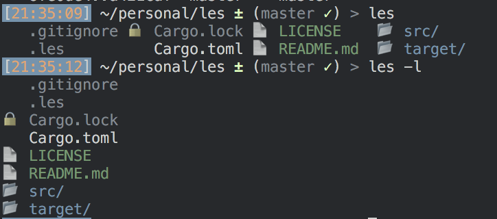

# les

A project configurable `ls`

## Screenshot

## Project Aims
Les is a configurable `ls` replacement with a rich feature-set and sensible
defaults. Les can be configured at the system and project level and allows a
user to colour or add icons to different files based on glob patterns.

## Why?
`ls` is a great multi-purpose tool but does little to address varied  contexts 
and hierachies in different projects. Adding visual information to a file list 
gives us additional structure through which to view a project.

Allowing users to configure `les` on a per-directory basis means emphasis can
change based on tech stack or project requirements,
